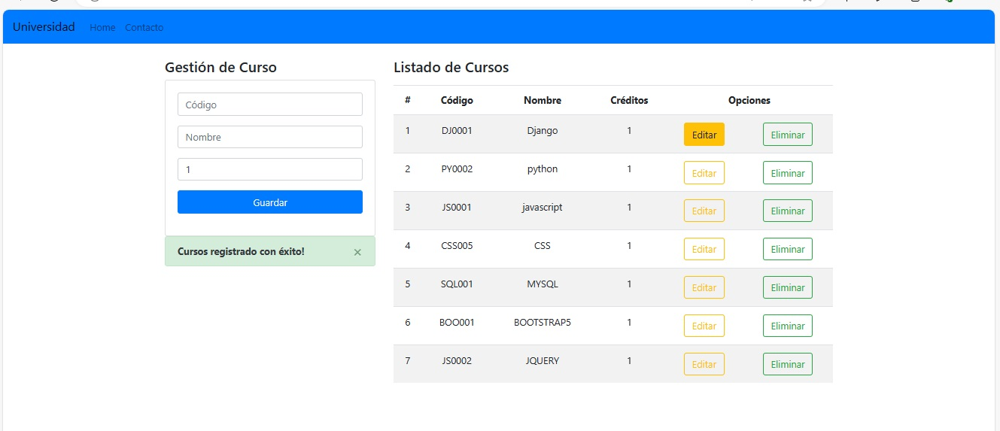
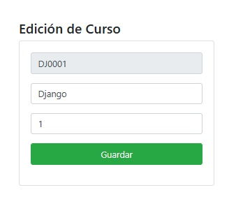
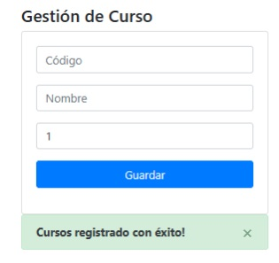
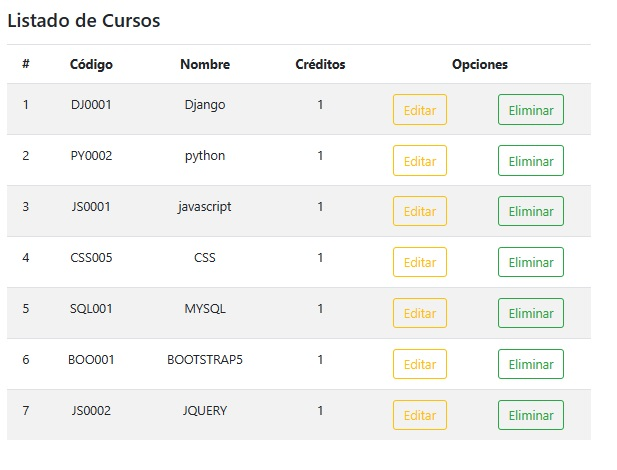

## web Cursos
- este proyecto es para un colegio o universidad 
que te permite gestionar curso nuevo y tener un registro 
de todo de ellos.

# Install

este proyecto  se necesita install '**_PYTHON_**'

## Comando para utilizar en "Django" se porne el comando 

- '_pip install django_'

## Para crear una "Proyecto" en PYTHON  
- Es con el comando "_django-admin startproject AppWebInicio_"
  - Este comando se poner dentro de la carpeta "AppWebInicio"

## se a utilizado los comando de:
- pip install crispy-bootstrap5
- pip install django-crispy-forms
## se a utilizado los comando de:
- primero se ejecuta este comando "py manage.py migrate" para tener la tabla creadas y después "py manage.py makemigrations "
## DATABASE:
- En este proyecto se utilizó db.sqlite3 como base de datos
   
# image
- Inicio

- Editar

- Crear Cursos

- Listado

## Para ejecutar este programa es con el
- comando "python manage.py runserver "
